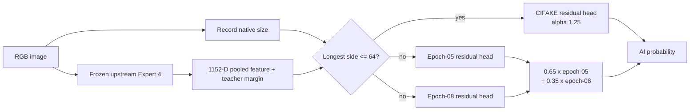

# SynthFlag — Training & Evaluation Evidence

This `Training-and-Eval` branch is the reproducible model-development record for SynthFlag, a TikTok TechJam 2026 Track 5 research prototype. It packages the selected lightweight heads, TEST1 predictions and metrics, class-symmetric augmentation code, a rights-clean retraining runner, model/data cards, and the proposed clean-room four-expert plan.

## Start here

- [Live judge-facing site](https://synthflag-techjam-evidence.vercel.app)
- [Full TEST1 report](training_eval/benchmarks/test1/README.md)
- [TEST1 dataset/source card](training_eval/benchmarks/test1/DATASET_SOURCES.md)
- [All metric cells](training_eval/benchmarks/test1/metrics_full.csv)
- [Raw TEST1 predictions](training_eval/benchmarks/test1/predictions.csv)
- [Download the three-head TEST1 bundle](https://drive.google.com/file/d/1NwOQ1hEQqCgVctdoRuwamZYjp832Vkse/view?usp=drivesdk)
- [Model card](training_eval/docs/MODEL_CARD.md)
- [Commercial data-rights gate](training_eval/docs/DATA_RIGHTS.md)
- [Augmentation laboratory](training_eval/docs/AUGMENTATION_LAB.md)
- [Professor Ng research-call record](training_eval/docs/PROF_NG_RESEARCH_CALL.md)
- [Proposed H200 clean-room retraining plan](training_eval/docs/FOUR_EXPERT_RETRAINING_PLAN.md)

## What was actually built

| Layer | Origin/status | What this repository contributes |
|---|---|---|
| Frozen visual representation | **Upstream research dependency**: SigLIP So400M | Exact dependency disclosure, safe loading contract and hash boundary |
| Three residual heads | **Team-trained research artifacts** | Frozen-feature training, replay, routing, stack selection and untouched regression gates |
| Augmentation system | **Team implementation** | Deterministic, label-symmetric recipes; codec/watermark/resolution shortcut controls |
| TEST1 | **Team evaluation** | 15,000 public identities, clean + composite views, 30,000 predictions, full integrity evidence |
| Four-expert H200 retrain | **Weights Created** | Created the weights currently in Drive |


## Selected TEST1 graph



Each head is:

```text
LayerNorm(1152) → Linear(1152, 256) → GELU → Dropout → Linear(256, 1)
```

The scalar output corrects the frozen teacher's two-class margin. It is not another two-logit classifier.

| Quantity | Value |
|---|---:|
| Frozen encoder parameters | 428,521,282 |
| Parameters per head | 297,729 |
| Three stored heads | 893,187 |
| Total loaded | **429,414,469** |
| Track ceiling | 2,000,000,000 |

The exact route, blend, calibration boundary, source hashes and distributable hashes are pinned in [`head_bundle_manifest.json`](training_eval/weights/head_bundle_manifest.json). The Drive ZIP contains only the three path-sanitized heads and documentation—no upstream encoder and no benchmark pixels.

## TEST1 benchmark

TEST1 sampled 5,000 images from each of three public suites, balanced 2,500 real and 2,500 AI-positive per suite. Each identity was scored once clean and once with a deterministic 1–5-operation composite corruption.

| Dataset | What it probes | Clean AUC | Augmented AUC | Clean / augmented FP | Clean / augmented FN |
|---|---|---:|---:|---:|---:|
| CIFAKE | Native 32×32 low-resolution real vs SD 1.4 | 0.9816 | 0.9095 | 288 / 499 | 113 / 388 |
| SID-Set | Fully synthetic plus locally tampered positives | 0.8691 | 0.8439 | 18 / 58 | 1,044 / 1,038 |
| WildFake | Six real families and 15 generator architectures | 0.9467 | 0.8785 | 316 / 861 | 272 / 257 |

## Augmentation research, not decoration

The central rule was that corruption must be a counterfactual of the same identity, never a class cue:

```text
P(recipe | real) = P(recipe | AI)
```

The implementation provides deterministic JPEG, blur, resize, noise, colour, crop and neutral overlay views. The deeper experiment added three anti-shortcut controls:

1. **Terminal-codec matching:** supervised real and AI views end in the same JPEG regime so native JPEG/PNG history cannot solve the task.
2. **Consistency-only low-resolution anchors:** 32 px and 64 px views receive no classification loss, preventing “small means fake”.
3. **Symmetric overlays/watermarks:** overlay presence is sampled independently of class, preventing “watermark means AI”.

The strongest augmentation-trained v3 candidate improved internal worst-view AUC from 0.658889 to 0.671894 but regressed CIFAKE and SID, so it was rejected. A failed shortcut is recorded as evidence, not promoted as progress. See the [augmentation laboratory](training_eval/docs/AUGMENTATION_LAB.md).

## False positives, false negatives and TikTok operations

For a creator platform, a false positive can wrongly question authentic work, interrupt distribution or monetization, and create appeals. That motivates a low-FPR threshold for any consequential action. It does **not** justify ignoring false negatives. But our focus was tuned to Tiktok's case and thus we optimised for FPs first before FNs.

The benchmark demonstrates why actions should be tiered:

- SID clean is conservative: only 18 FP, but 1,044 locally concentrated AI edits are missed.
- WildFake augmented preserves 0.8972 recall but produces 861 FP and only 0.6556 specificity.
- A strict threshold can trigger provenance checks or human review; a lower threshold may populate a non-punitive risk queue.
- No detector probability should be treated as proof of authorship.

## Commercial-data gate

The existing 25,000-source pool is historical experiment provenance, **not a commercial allowlist**. Two explicit blockers are enough to require a new run:

- 9,311 bulk Open Images rows used a source-level CC BY assertion without item-by-item verification; and
- 986 precomputed guided-diffusion/BigGAN sample pixels lack an explicit data-specific licence, with 682 entering the large-head gradient split.

A strict retrain admits only receipt-complete CC0/CC BY records and explicitly licensed generated datasets, preserves attribution, and fails closed on CC12M/CommonPool/RedCaps pixels, NC material, unknown outputs, WildFake pixels and the two blocker tranches above. The full source-by-source decision is in [`DATA_RIGHTS.md`](training_eval/docs/DATA_RIGHTS.md).

## Run the package

From the repository root in PowerShell:

```powershell
python -m venv .venv
.\.venv\Scripts\Activate.ps1
python -m pip install -r training_eval\requirements.txt
python -m pytest training_eval\tests -q
```

Recompute metrics from the immutable TEST1 predictions:

```powershell
python training_eval\scripts\evaluate_predictions.py `
  training_eval\benchmarks\test1\predictions.csv `
  --output-json $env:TEMP\synthflag_recomputed_metrics.json `
  --output-csv $env:TEMP\synthflag_recomputed_metrics.csv `
  --score-column reported_probability `
  --group-columns dataset view
```

Train a new residual head only after producing a source-disjoint, rights-clean frozen-feature cache with arrays `features`, `teacher_logits` or `teacher_margin`, `labels`, `split`, `group_id` and `view`:

```powershell
python training_eval\scripts\train_head.py `
  C:\path\to\rights_clean_features.npz `
  C:\path\to\new_head.pt `
  --replay C:\path\to\label_free_preservation.npz `
  --device cuda
```


## Repository map

```text
training_eval/
├── benchmarks/test1/        # report, metrics, predictions, figures, integrity
├── configs/                 # selected graph, TEST1 and proposed retrain contracts
├── docs/                    # model, rights, augmentation, H200 and interview cards
├── scripts/                 # clean-room head training, augmentation, metrics, verification
├── tests/                   # synthetic contract/regression tests
└── weights/                 # Drive link and hash/routing manifest; no large binaries
```

The website source remains on this branch so the same evidence can be rendered interactively. API secrets and model binaries are not committed.
